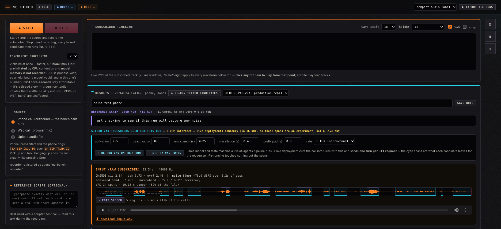

# NC Bench UI

A dev web UI for A/B-testing noise-cancellation candidates on real audio:
record a **phone call** (outbound — the bench places it), a **web call**
(browser mic), or **upload a file** — then run the recording through every ticked NC
candidate (singles or chains) and compare **STT transcripts**, **waveforms**,
and **playable / downloadable output audio** side by side. Every run is stored
and revisitable from the history table.



## Run

```bash
uv sync --python 3.12                        # once
.venv/bin/python scripts/fetch_models.py     # once; ~70 MB of model files
.venv/bin/python main.py                     # http://localhost:8777
```

**No model weights are stored in this repo.** `fetch_models.py` pulls every one
of them from its publisher's own URL into the gitignored `models/`, and checks a
pinned SHA-256 on each. `--verify` re-hashes what is already on disk. See
[Models and licences](#models-and-licences) for who owns what.

Two candidate families need credentials that are not supplied here. Both
degrade politely — the UI greys them out with a reason and everything else
still runs:

- **Hecttor** (`hecttor-*`) needs its proprietary SDK wheel, which is *not*
  redistributed here and is not on PyPI. With a valid licence:
  `uv pip install /path/to/hecttor_sdk-<version>-<platform>.whl`, then set
  `HECTTOR_API_KEY`.
- **ai-coustics** (`aic-sdk`) needs a self-service trial key in
  `AIC_LICENSE_KEY`.

Configuration lives in `.env` (see `.env.example`): LiveKit project, STT
endpoint, Hecttor key + default model/weight/rate/chunk, port.

> `uv sync` prunes anything not in the lock, so it will uninstall a
> manually-installed Hecttor wheel. Re-run the `uv pip install` above after a
> sync.

## Using it

1. Pick a **source**:
   - **Phone call** — press Start and **the phone rings**. The bench places an
     outbound SIP call to `LK_SIP_CALL_TO` over `LK_SIP_TRUNK_ID` (both `.env`)
     into a room it owns. Pick up, talk, then either **hang up or press Stop** —
     both end the recording and run NC. See *Phone mode* below.
   - **Web call** — Start joins a fresh room and publishes the microphone with
     browser echo-cancellation / noise-suppression / AGC **disabled**, so the
     noise survives for the NC to act on.
   - **Upload** — any format ffmpeg can read; goes straight to processing.
2. Tick **candidates** (at least one; "No NC" is the control). Chains run
   processors in order — edit `candidates.json` to add combos or Hecttor
   model/weight variants; restart to reload.
3. **Start** → record (single subscriber timeline shows live RMS) → **Stop**.
   Both buttons gray out while the candidates run (NC → STT per candidate);
   results stream in as each finishes.
4. **History**: every run keeps `input.wav` + one output wav per candidate +
   `meta.json` under `data/runs/<id>/`; click a row to reload it.

## Architecture

```
static/index.html        the whole UI (no build step)
nc_bench/server.py       FastAPI: session start/stop, upload, candidates,
                         runs history, /ws (levels + progress events)
nc_bench/recorder.py     LiveKit rtc subscriber: web room join + phone-room
                         poller; 48 kHz mono capture + 20 ms RMS events
nc_bench/pipeline.py     input wav → per-stage soxr resample → 20 ms blocks
                         through stateful processors → 16 kHz s16 output
nc_bench/processors/     registry: hecttor (proprietary SDK, optional),
                         specnc (DPDFNet/GTCRN/UL-UNAS), fastenhancer, dtln,
                         rnnoise (ffmpeg arnndn), aic, hush, passthrough
scripts/fetch_models.py  downloads + hash-verifies every model into models/
nc_bench/stt.py          POSTs 16 kHz wav to a /recognize endpoint (WHISPER_URL)
nc_bench/store.py        data/runs/<id>/ meta.json + wavs
scripts/selfcheck.py     assert-based check over all available candidates
```

## Candidates

A candidate is one entry in `candidates.json`: an id, a label, and a chain of
zero or more processing stages. `none` is the control — the untouched audio,
which every other candidate is compared against. Add or edit entries and restart
to reload; no code changes are needed for a new combination.

### Offline

These run on uploads, live recordings and re-runs alike, on CPU. *Delay* is the
structural live latency — framing plus whatever the model holds back internally,
measured rather than quoted — and is what `algo_delay_ms` reports.

| Candidate ids | What | Rate | Delay | Source |
|---|---|---|---|---|
| `hecttor-*` (coda-vi, coda, crest-1/2, mist, weight 0.75) | commercial SDK; the only offline voice-isolation model wired here | 16 k | 20 ms | separately licensed wheel (not shipped) |
| `dpdfnet2-8k`, `dpdfnet8-8k` | **native 8 kHz** — cleans in the PSTN band, before any upsampling | 8 k | 40 ms | HF `Ceva-IP/DPDFNet` |
| `dpdfnet2`, `dpdfnet8`, `dpdfnet-baseline` | the same family at 16 kHz, for the band-split comparison | 16 k | 40 ms | HF `Ceva-IP/DPDFNet` |
| `gtcrn` | 23.7 k parameters — the "how cheap can this get" data point | 16 k | 16 ms | sherpa-onnx release |
| `ulunas` | UL-UNAS, ultra-light, a different architecture family | 16 k | 16 ms | upstream streaming export |
| `fastenhancer-t/-s/-l` | strong quality-per-FLOP claims; `-T` is the cheapest model here | 16 k | 16–26 ms | DNS-trained wav2wav release |
| `hush`, `hush-atten12` | background-**speaker** suppression — DeepFilterNet3 retrained on competing voices, 16 kHz native | 16 k | 20 ms | pulp-vision/Hush prebuilt library |
| `dtln` | long-standing open baseline | 16 k | 24 ms | breizhn/DTLN pretrained pair |
| `rnnoise-sh`, `rnnoise-bd` | 2018 baseline, via ffmpeg's `arnndn` filter | 48 k | 10 ms | GregorR/rnnoise-models |
| `aic-sdk` | ai-coustics standalone; needs `AIC_LICENSE_KEY` | — | — | PyPI `aic-sdk` |

DPDFNet, GTCRN and UL-UNAS publish the *same* streaming ONNX shape — one STFT
frame plus opaque caches in, enhanced frame plus caches out — so a single
wrapper (`spec_onnx.py`) drives all of them, reading each model's framing
(n_fft, hop, window, rate) out of its own ONNX metadata. Adding another model of
that shape is a row in `_MODELS` and a URL in `fetch_models.py`.

Hush is the exception: its ONNX bundle is the three raw DeepFilterNet graphs,
which take ERB features and return gains rather than audio. The project ships a
prebuilt native library with a frame-in/frame-out C API, so `hush.py` drives that
through ctypes. Note that its `atten_lim_db` runs opposite to what the name
suggests — **100 = unlimited** (the upstream default) and **0 = passthrough**, so
setting it to 0 expecting "no cap" benchmarks a do-nothing chain.

Two properties are asserted by `scripts/selfcheck.py`, because both fail
silently otherwise:

- **Reconstruction** — with the model bypassed, analysis → overlap-add must
  return the input bit-for-bit (max error 1.2e-07 across all seven spectral
  models). A wrong window or a missing window² normalisation still "cuts noise";
  it just eats the speech along with it.
- **Output shift** — every candidate's output is cross-correlated against its
  input. FastEnhancer, GTCRN and UL-UNAS are 0 ms; DPDFNet is 40 ms (its
  deep-filter stage returns audio 30 ms old on top of 10 ms of framing), DTLN
  24 ms, arnndn 10 ms. Those measured figures are what `algo_delay_ms` reports,
  so a live latency budget can be read straight off the result cards.

Not currently wired: **LL-SDR** (no released checkpoint — training code only) and
**faster-enhancer-py** (an int8 48 kHz C port of FastEnhancer, which needs
`faster-enhancer.c` built locally).

### Chains

A chain runs its stages in order and the pipeline resamples between them, so an
8 kHz stage feeding a 16 kHz stage is two rows of JSON rather than any code.

One chain shape has a structural argument behind it: **suppress in the call's own
band, then isolate at 16 kHz**, so each model sees input close to its training
distribution. The rest exist to be falsified — stacking two ML denoisers is
artifact on top of artifact, and the point is to measure how much that costs.

| Candidate | What it tests |
|---|---|
| `dpdfnet2-8k+hecttor-coda-vi` | the band-split: does in-band cleanup before isolation beat isolation alone? |
| `dpdfnet2-8k+hush` | the same idea with no licence cost |
| `dpdfnet2+hush` | control for the above — same pair, suppression at 16 kHz instead of 8 kHz. If it ties, the band-split is not earning its 40 ms |
| `fastenhancer-t+hecttor-coda-vi` | 16 kHz stacking with the cheapest suppressor available |
| `gtcrn+hush` | the fully-open floor: cheapest open suppressor plus the open isolator |
| `dtln+hecttor-coda-vi` | an open suppressor ahead of the commercial isolator, as a reference point |

Isolation-before-suppression is deliberately absent: the isolator is the more
fragile model, and feeding it raw audio is the point of the band-split test.
Latency **adds** — the band-split chain totals 60 ms (40 + 20), which is a
live-viability constraint rather than a detail. Cloud candidates cannot appear in
chains at all; they process inside the rtc stack, not in this pipeline.

Early results on a clean 11.8 kHz microphone recording were consistent with the
artifact-stacking expectation: every chain landed at or below its own best single
stage on DNSMOS OVRL, and the more aggressive the pair, the larger the drop. That
was a weak test — the recording had little worth removing — but the in-band
variant did beat its own 16 kHz control, which is the band-split hypothesis
pointing in the right direction on one clip. See `docs/` for a fuller comparison
across 20 runs.

### Cloud (live rail only)

Krisp and ai-coustics models hosted by LiveKit run on the **live rail only**. The
recorder is an embedded livekit-agents worker dispatched into the session's room,
and each ticked cloud candidate gets its own
`rtc.AudioStream(noise_cancellation=...)` on the same track while recording.
They cannot process uploads or re-run old recordings, because the plugins
authenticate through the live Cloud room. Check one headlessly with
`scripts/live_loopback_test.py <MODEL>` (e.g. `BVC`, `AIC:QUAIL_VF_S`).

| Candidate ids | Model | Notes |
|---|---|---|
| `krisp-nc`, `krisp-bvc`, `krisp-bvc-tel` | Krisp NC / BVC / BVC Telephony | metered by LiveKit Cloud |
| `aic-quail-l`, `aic-vf-s`, `aic-vf-l` | ai-coustics via `livekit-plugins-ai-coustics` | metered by LiveKit Cloud, no separate key |

Any `EnhancerModel` name the installed ai-coustics plugin exposes works as a
`"lk_model": "AIC:<NAME>"` entry in `candidates.json`.

Two constraints the code already handles, worth knowing before extending it:

- **Both plugins must be imported on the main thread** (`lk_cloud.preload()` at
  server startup). A job-thread import fails silently and the stream degrades to
  passthrough with `code=209`.
- **The recording participant must be a genuine agents-framework job.** A plain
  rtc join is refused. If a Krisp candidate ever regresses to passthrough, the
  recorder detects output ≈ raw input and reports it as a candidate error rather
  than presenting unprocessed audio as an NC result.

## Phone mode

**Outbound**: Start creates a room, dispatches the recorder into it, then places a
SIP participant on `LK_SIP_TRUNK_ID` dialling `LK_SIP_CALL_TO`. The phone rings;
answering it starts the recording.

| `.env` | meaning |
|---|---|
| `LK_SIP_TRUNK_ID` | outbound trunk the call goes out on |
| `LK_SIP_CALL_TO` | number to ring, E.164 |
| `LK_SIP_RINGING_TIMEOUT_S` | give up ringing after this (default 45) |
| `LK_AGENT_NAME` | what the recorder registers as (default `nc-bench-recorder`) |

Details worth knowing:

- **The recorder is dispatched before the dial.** A job that arrives after the
  answer misses the opening seconds — exactly where a scripted read starts.
- **`wait_until_answered=True`, on a background task.** Busy / declined / no-answer
  then raises instead of silently producing an empty recording, and the UI still
  returns immediately to show "ringing". Failures surface as `call_failed`.
- **`krisp_enabled=False` on the SIP participant.** The trunk-side filter would
  clean the audio this bench exists to measure.
- **Hang up = press Stop.** The job watches for the SIP participant leaving and
  trips the same stop flag, so a call that ends by itself still runs NC. Pressing
  Stop deletes the room, which hangs up the leg.
- **`LK_AGENT_NAME` deliberately does *not* match the project's inbound SIP
  dispatch rule.** LiveKit load-balances jobs across every worker registered
  under a name, so sharing one would let the bench receive real inbound calls
  meant for another agent. Outbound mode dispatches the recorder explicitly, so
  the bench and another agent can share a project safely.

## Scoring

Every run is scored automatically (`nc_bench/scoring.py`); results live in
`meta.json` and on the cards.

| Metric | What | Reliability notes |
|---|---|---|
| **DNSMOS P.835** (SIG/BAK/OVRL) | Microsoft's reference-free MOS predictor (`models/dnsmos/sig_bak_ovr.onnx`), on the input and every output | The workhorse. Differences < ~0.1 MOS are noise. SIG = did the voice survive, BAK = did the background die |
| **Gap-RMS / noise reduction (dB)** | silero-VAD finds *confident* no-speech windows on the raw input (prob < 0.15 sustained ≥ 1 s, edges trimmed); every output is measured in those same windows; shown as dB vs input | Trustworthy when it speaks; abstains ("n/a") when VAD finds no confident gaps — notably under heavy background *speech*, where DNSMOS-BAK carries the comparison instead. Sanity check: the passthrough candidate should read ≈ 0 dB |
| **Measured band** (kHz) | The rolloff edge — highest frequency still carrying signal — on the input at its native rate and on every output at 16 kHz | The file's sample rate does not reveal this: LiveKit hands every track over at 48 kHz, so an 8 kHz phone call and a mic recording look identical in the header. ~4 kHz = PSTN, ~7 kHz = wideband trunk, 15 kHz+ = mic. Read it before trusting any comparison involving the 8 kHz models |
| **WER** | Word error rate vs the optional **reference script** field — read a fixed script during a test call (or provide the truth for an upload) | The only exact metric here, and the most decision-relevant (the NC feeds STT). Only as good as the script matching what was actually said |
| **Latency** | Per candidate: `init_ms` (chain construction), `block_ms_mean/p95` (processing per 20 ms block — must be ≪ 20 ms to be live-viable), `algo_delay_ms` (structural buffering the chain adds regardless of CPU) | Measured, not modeled — `algo_delay_ms` sums each stage's framing plus its measured internal lookahead (see *Output shift* above). Whole-file stages (`rnnoise-*`) report no per-block numbers rather than a flattering ~0 ms. Live-rail (cloud) candidates have no latency row: they process inside the rtc stack in real time |

Scoring never fails a run: errors land in `scores_error` on the affected
candidate and everything else proceeds.

**Rankings are per-run, never averaged across runs.** Each run is a different
recording, and each run only scores the candidates that were ticked for it — so a
mean across history would rank the *audio* (and the coverage) rather than the
models. The Rankings box therefore ranks within whichever run is loaded, and
shows each candidate's Δ against that run's own `none` control, which is the only
apples-to-apples number available.

## Models and licences

Nothing in this table is stored in this repository. `scripts/fetch_models.py`
downloads each file from the publisher's own URL into the gitignored `models/`
and verifies a pinned SHA-256. Licences below are the publishers' own, recorded
here as attribution and as a pointer — verify them independently before relying
on one, and note that a licence can change.

| Used for | Project | Licence |
|---|---|---|
| `dpdfnet*` | [Ceva-IP/DPDFNet](https://huggingface.co/Ceva-IP/DPDFNet) | Apache-2.0 |
| `gtcrn` | [Xiaobin-Rong/gtcrn](https://github.com/Xiaobin-Rong/gtcrn), ONNX export via [k2-fsa/sherpa-onnx](https://github.com/k2-fsa/sherpa-onnx) (Apache-2.0) | MIT |
| `ulunas` | [Xiaobin-Rong/ul-unas](https://github.com/Xiaobin-Rong/ul-unas) | MIT |
| `fastenhancer-*` | [aask1357/fastenhancer](https://github.com/aask1357/fastenhancer) | MIT |
| `hush`, `hush-atten12` | [pulp-vision/Hush](https://github.com/pulp-vision/Hush) (Weya NC) | Apache-2.0 |
| `dtln` | [breizhn/DTLN](https://github.com/breizhn/DTLN) | MIT |
| `rnnoise-*` | [GregorR/rnnoise-models](https://github.com/GregorR/rnnoise-models) | upstream claims no copyright over the weights |
| DNSMOS scoring | [microsoft/DNS-Challenge](https://github.com/microsoft/DNS-Challenge) | CC BY 4.0 |
| VAD | [snakers4/silero-vad](https://github.com/snakers4/silero-vad) via `livekit-plugins-silero` | MIT |

Three integrations are **commercial and bring their own terms**. This repo
contains only the code that calls them — no SDK, no binary, no key:

| Candidates | Vendor | How it is obtained |
|---|---|---|
| `hecttor-*` | Hecttor AI | proprietary per-licensee wheel, installed manually; needs `HECTTOR_API_KEY` |
| `aic-sdk`, `aic-*` | ai-coustics | `aic-sdk` from PyPI (Apache-2.0 wrapper over a proprietary core); needs `AIC_LICENSE_KEY` |
| `krisp-*` | Krisp, via LiveKit Cloud | `livekit-plugins-noise-cancellation`, under LiveKit's terms; runs on LiveKit Cloud only |


## Notes / limits

- **Dev tool**: no auth on any endpoint; single session at a time. It binds
  `PORT` on all interfaces and serves anyone who can reach it, so it belongs on
  localhost or behind a proxy.
- Phone mode records **only the far end (the phone participant)** — the subscriber
  leg, before any NC. The bench publishes silence back, nothing else.
- Hecttor init errors (e.g. the machine-bound installation ID going stale
  after an OS update — files under `~/Library/Application Support/Hecttor/`)
  surface as per-candidate errors, not crashes. Deleting those files forces
  a re-registration on next init (may consume an installation seat).
- Adding a processor = one file in `nc_bench/processors/` + a registry line +
  optional `candidates.json` entries. If it publishes a per-frame streaming ONNX,
  it's just a row in `spec_onnx.py`'s `_MODELS` plus a URL in `fetch_models.py`.
- **Gap-RMS needs noise in the gaps.** On a near-silent input (mic recording with
  the gate closed, gap RMS ≈ −65 dB) the "noise cut" column divides by silence
  and prints absurd numbers like 115 dB. Compare candidates on it only when the
  input's own `gap_rms_db` is well above the noise floor.
- **An 8 kHz model on wideband input scores well while destroying content.**
  Measured on a 15.6 kHz mic recording: `dpdfnet2-8k` came out on top on DNSMOS
  OVRL (3.14 vs 2.60 passthrough) *and* its output band read 3.8 kHz — it had
  thrown away everything above 4 kHz, and DNSMOS barely noticed. Check the band
  column before reading a narrowband model's win as a win. On a real phone call
  there is nothing above 4 kHz to lose, which is the whole point of those two
  candidates.
- `livekit-plugins-noise-cancellation` is pinned to **0.2.6** — the version the
  live Krisp path was verified on. Bump deliberately, then re-run
  `scripts/live_loopback_test.py NC`.
- This tool is only tested and optimized for Safari and may have issues running
  on other web browser.
